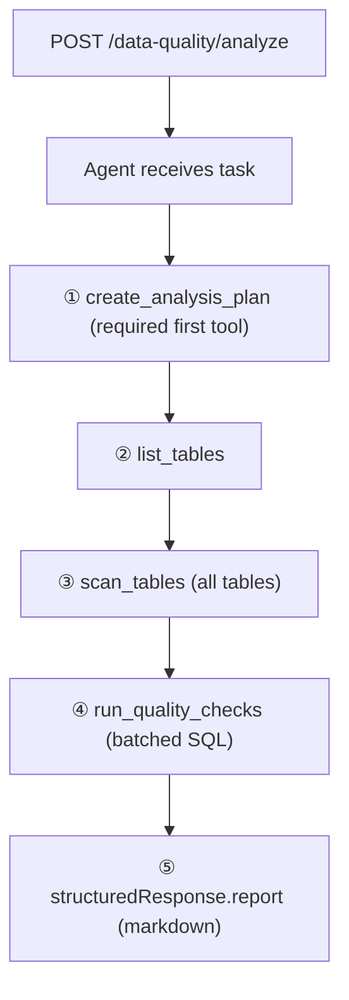

# Data Quality Analysis Agent

Design for a dedicated LangChain agent that inspects a PostgreSQL schema and produces a markdown data-quality report for every table.

## Endpoint

| Method | Path | Description |
|--------|------|-------------|
| `POST` | `/data-quality/analyze` | Run a full data-quality analysis (SSE stream) |

### Request body (optional)

```json
{
  "schema": "public"
}
```

Defaults to `public` when omitted.

### SSE events

Same event vocabulary as `/chat`, with `report` instead of `summary`:

| Event | Payload | When |
|-------|---------|------|
| `started` | `{}` | Analysis begins |
| `tool_start` | `{ name, callId, input }` | Agent invokes a tool |
| `tool_result` | `{ name, callId, output }` | Tool succeeds |
| `tool_error` | `{ name, callId, message }` | Tool fails |
| `token` | `{ report: "<chunk>" }` | Report streamed in chunks |
| `done` | `{ report: "<full markdown>" }` | Analysis complete |
| `error` | `{ message }` | Unrecoverable failure |
| `cancelled` | `{}` | Client disconnected |

---

## Agent loop

The agent is a ReAct loop (`createAgent`) with structured output. Every run follows the same high-level phases:



### Phase details

1. **Plan** — Agent calls `create_analysis_plan` before any database access. The plan lists every table and the checks that will run on it. This makes the run auditable and prevents ad-hoc skipping.
2. **Discover** — `list_tables` returns all base tables in the target schema. The agent reconciles this list with the plan (add missing tables, note exclusions).
3. **Profile** — For each table, `inspect_table` returns columns, keys, foreign keys, and an estimated row count.
4. **Check** — For each planned check, `execute_readonly_sql` runs a single `SELECT`. Standard check patterns are documented in the system prompt.
5. **Report** — The agent writes a markdown `report` covering every table: profile summary, findings, severity, and recommended fixes.

---

## Tools

### 1. `create_analysis_plan` (mandatory first call)

Records the analysis plan. No database access.

**Input**

| Field | Type | Description |
|-------|------|-------------|
| `schema` | `string` | Target schema (default `public`) |
| `tables` | `string[]` | Tables to analyze |
| `checks` | `Check[]` | Checks to run |
| `notes` | `string?` | Optional context |

**Check**

| Field | Type | Description |
|-------|------|-------------|
| `id` | `string` | Stable id, e.g. `null-rate`, `duplicate-pk` |
| `name` | `string` | Human-readable name |
| `description` | `string` | What the check validates |
| `tables` | `string[]` | Tables this check applies to (`["*"]` = all) |

**Output** — JSON confirmation of the accepted plan.

---

### 2. `list_tables`

Lists base tables in the schema.

**Input**

| Field | Type | Description |
|-------|------|-------------|
| `schema` | `string?` | Defaults to `public` |

**Output** — `{ schema, tables: string[], count: number }`

**SQL**

```sql
SELECT table_name
FROM information_schema.tables
WHERE table_schema = $schema
  AND table_type = 'BASE TABLE'
ORDER BY table_name;
```

---

### 3. `scan_tables`

Profiles **all** tables in a single tool call (replaces per-table `inspect_table`).

**Input**

| Field | Type | Description |
|-------|------|-------------|
| `schema` | `string` | Defaults to `public` when empty |
| `tables` | `string[]` | Tables to scan; empty array scans every base table |

**Progress** — emits `tool_progress` events: `Scanning tables: actor (3/15)`

**Output** — JSON with `profiles[]` for every table.

---

### 4. `run_quality_checks`

Runs **multiple** read-only SQL checks in one tool call (replaces per-query `execute_readonly_sql`).

**Input**

| Field | Type | Description |
|-------|------|-------------|
| `checks` | `{ sql, purpose }[]` | All quality-check queries to run |

**Progress** — emits `tool_progress` events: `Running quality checks: null rate for customer.email (2/40)`

**Output** — JSON with `results[]` including any per-check errors.

---

## Standard check catalog

The system prompt instructs the agent to include these checks (adapt SQL per table):

| Check id | What it finds | Example SQL pattern |
|----------|---------------|---------------------|
| `row-count` | Empty or unexpectedly small tables | `SELECT COUNT(*) FROM …` |
| `null-rate` | High NULL % on important columns | `SELECT col, COUNT(*) FILTER (WHERE col IS NULL) …` |
| `duplicate-pk` | Duplicate primary-key values | `SELECT pk, COUNT(*) … HAVING COUNT(*) > 1` |
| `orphan-fk` | FK values with no parent row | `LEFT JOIN parent … WHERE parent.pk IS NULL` |
| `invalid-dates` | Future dates, epoch zeros | `WHERE date_col > NOW()` or `= '1970-01-01'` |
| `domain-outliers` | Negative amounts, empty strings | Column-specific `WHERE` clauses |

---

## Structured response

```typescript
z.object({
  report: z.string().describe("Markdown data-quality report for all tables"),
});
```

### Report outline

```markdown
# Data Quality Report — {schema}

## Executive summary
- Tables analyzed, overall health score, top issues

## Plan
- Table copied from create_analysis_plan

## Findings by table
### {table_name}
- Profile (rows, columns, keys)
- Check results table: Check | Status | Details
- Severity: critical / warning / info

## Recommendations
- Prioritized remediation steps
```

---

## File layout

```
backend/
  docs/
    data-quality-agent.md          ← this file
  src/
    agents/
      dataQualityAgent.ts
    config/
      dataQualityPrompts.ts
    lib/
      sqlSafety.ts
    routes/
      dataQuality.ts
    services/
      streamDataQuality.ts
    tools/
      dataQualityTools.ts
```

---

## Differences from text-to-SQL agent

| | Text-to-SQL | Data Quality |
|---|-------------|--------------|
| Trigger | User question | Endpoint invoke (no question) |
| First tool | `execute_sql` | `create_analysis_plan` |
| Scope | Single query answer | All tables in schema |
| Output field | `summary` | `report` |
| Prompt focus | Join paths, LIMIT 5 | Completeness, consistency, validity |
